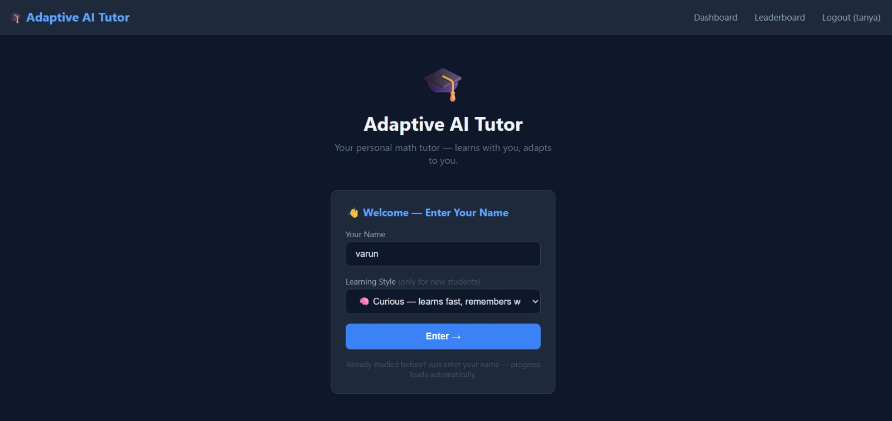
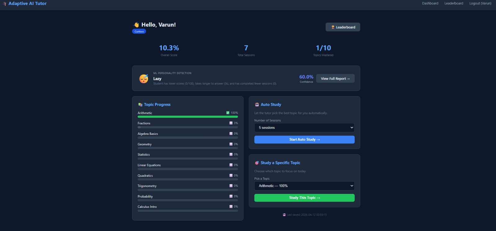
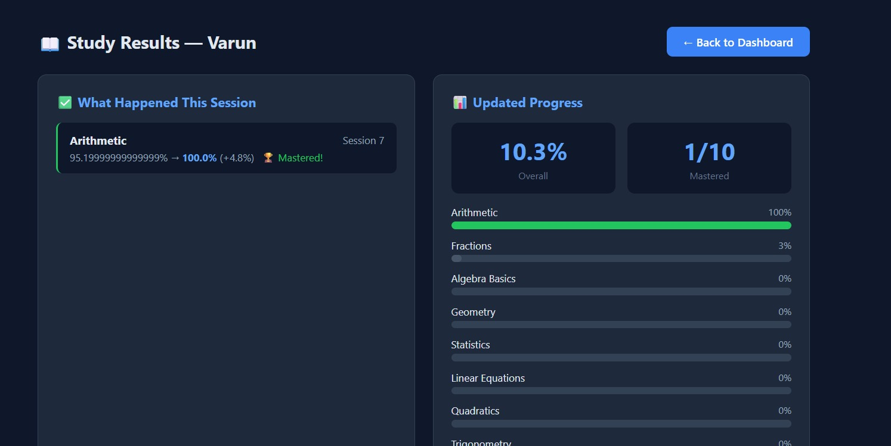
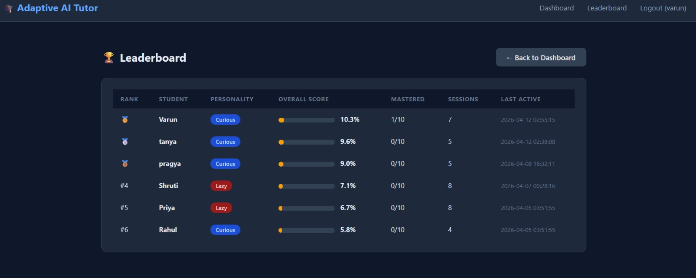

# 🎓 Adaptive AI Tutor

A personal AI tutor that teaches you math step by step — remembers your progress, adapts to how you learn, and never gets tired. Now powered by **Machine Learning** that predicts your performance, detects your learning personality automatically, and finds your weak spots.

---

## 🖼️ Screenshots

### Login Page


### Dashboard


### Study Results


### Leaderboard


### Personality Analysis


---

## 📁 Project Structure

```
adaptive-ai-tutor/
├── tutor.py                 ← brain of the project (core logic)
├── main.py                  ← run this in terminal to study
├── app.py                   ← run this to open the web app
├── analysis.py              ← compare all students in tables
├── charts.py                ← visual progress charts
├── ml_engine.py             ← 3 ML models (predict, recommend, detect gaps)
├── personality_detector.py  ← Random Forest personality detection
├── requirements.txt         ← libraries needed
├── README.md                ← you are here
├── 📁 templates/            ← web app pages
│     ├── base.html
│     ├── index.html
│     ├── dashboard.html
│     ├── study_result.html
│     ├── leaderboard.html
│     └── personality.html   ← personality analysis page
├── 📁 screenshots/          ← project screenshots
└── 📁 student_data/         ← auto-created, stores student progress
```

---

## 🚀 How to Run — Web App (Recommended)

**Step 1** — Open your project folder → click address bar → type `powershell` → Enter

**Step 2** — Install all libraries (one time only):
```bash
py -m pip install -r requirements.txt
```

**Step 3** — Start the web app:
```bash
py app.py
```

**Step 4** — Open your browser and go to:
```
http://localhost:5000
```

---

## 💻 How to Run — Terminal Version

```bash
py main.py                  → study as a student
py analysis.py              → see student comparison tables
py charts.py                → see visual progress charts
py ml_engine.py             → run ML model test report
py personality_detector.py  → run personality detection test
```

---

## 👤 How Students Register

No signup needed. Just:
1. Open `http://localhost:5000`
2. Type your name
3. Pick your learning style
4. Click **Enter**

Returning students just type their name — progress loads automatically.

---

## 📋 The Web App Pages

| Page | What it does |
|---|---|
| Login | Enter name and learning style |
| Dashboard | See progress, study topics, ML insights, personality snapshot |
| Study Results | See what you learned each session |
| Leaderboard | Compare all students ranked by score |
| Personality | Full ML personality analysis with confidence and tips |

---

## 📚 Topics & Learning Order

| # | Topic | Needs First |
|---|---|---|
| 1 | Arithmetic | Nothing — start here |
| 2 | Fractions | Arithmetic |
| 3 | Algebra Basics | Arithmetic + Fractions |
| 4 | Geometry | Arithmetic |
| 5 | Statistics | Arithmetic + Fractions |
| 6 | Linear Equations | Algebra Basics |
| 7 | Quadratics | Linear Equations |
| 8 | Trigonometry | Geometry + Algebra Basics |
| 9 | Probability | Statistics + Fractions |
| 10 | Calculus Intro | Quadratics + Trigonometry |

---

## 🎭 Student Personalities

| | Curious | Lazy | Anxious |
|---|---|---|---|
| Learns | Fast | Slow | Medium |
| Forgets | Slowly | Quickly | Medium |
| Weakness | None | Needs repetition | Panics without prerequisites |

> From v2, personality is **auto-detected by ML** every 5 sessions — no manual picking needed.

---

## 🤖 Machine Learning Features

### ml_engine.py — 3 ML Models

| Model | Algorithm | What it does |
|---|---|---|
| Performance Predictor | Linear Regression | Predicts your next quiz score |
| Difficulty Recommender | Decision Tree | Recommends Easy / Medium / Hard |
| Knowledge Gap Detector | KMeans Clustering | Finds your weakest topics |

**How data flows:**
```
Student studies → session saved to student_data.json
→ ML trains on real data → predictions shown on dashboard
```

### personality_detector.py — Personality Detection

| Feature | Detail |
|---|---|
| Algorithm | Random Forest Classifier (100 trees) |
| Input features | Avg score, score trend, time taken, time variance, topics tried, sessions done |
| Output | curious / lazy / anxious + confidence % |
| Cold start | Uses 120 synthetic profiles until real data exists |
| Auto-update | Re-detects every 5 sessions silently |

**What each feature tells the model:**

- **Avg score** → overall performance level
- **Score trend** → improving (+) or declining (-)
- **Avg time** → how fast/slow the student answers
- **Time variance** → how consistent their speed is
- **Topics tried** → how explorative they are
- **Session count** → how engaged they are

**Personality rules:**
- `curious` → high scores, positive trend, fast, many topics explored
- `lazy` → low scores, slow responses, few sessions
- `anxious` → high time variance, score drops when difficulty increases

---

## 💾 How Saving Works

- Progress saves automatically after every session
- Each student gets their own file in `student_data/`
- ML session data saves to `student_data.json`
- Same name = loads your progress. New name = fresh start
- Delete your `.json` file to start over

---

## ❓ Quick FAQ

**Need to install anything?**
```bash
py -m pip install -r requirements.txt
```

**How to add a new student?**
Open the website and enter a new name — done automatically.

**Why does the ML show sample data at first?**
Until a student completes real sessions, ML uses built-in sample data as a fallback. It switches to real data automatically after the first session.

**How does personality auto-detection work?**
Every 5 sessions, the Random Forest model analyses the student's score trend, speed, and consistency — and updates their personality silently if it changes.

**Forgot your name?**
Check the leaderboard page — all students are listed there.

**Want to start fresh?**
Delete your file from the `student_data` folder.

---

## 🛠️ Requirements

```
Python 3.11+
flask>=2.0.0          (web app)
pandas>=2.0.0         (analysis tables)
matplotlib>=3.7.0     (charts)
scikit-learn>=1.3.0   (ML models + personality detector)
numpy>=1.24.0         (ML calculations)
```

Install everything at once:
```bash
py -m pip install -r requirements.txt
```

---

## 📦 Coming Soon

- Groq AI explanations — real AI tutoring responses per topic
- Online deployment — access from anywhere
- Password login system — secure student accounts
- Confidence scoring — track what students think they know vs actually know
- Study heatmap — GitHub-style activity calendar
- What-if simulator — "study 3 more times → predicted score goes from 57 → 74"

---

## 🔗 GitHub

[github.com/swarnimapatel1402/adaptive-ai-tutor](https://github.com/swarnimapatel1402/adaptive-ai-tutor)
